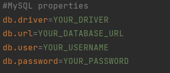
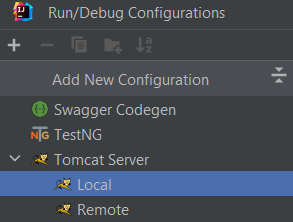
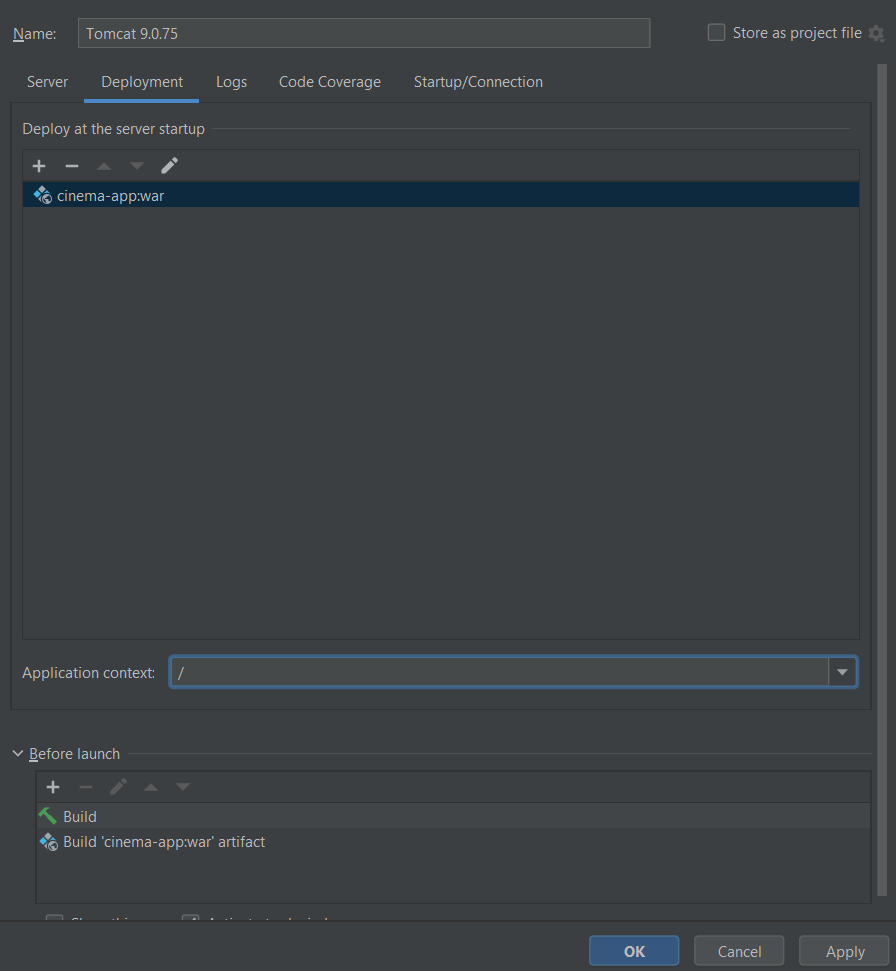

# Cinema-app

REST web application for ticket reservation. It implements the main functions, such as:
1. displaying movies that are currently at the box office
2. shopping cart with the ability to add tickets to it and create an order based on the added tickets
3. searching for available movie sessions by date

## Table of Contents

[Functionality](#functionality)

[Endpoints](#endpoints)

[Project Structure](#project-structure)

[Technologies Used](#technologies-used)

[Instructions for Launching the Project](#instructions-for-launching-the-project)

## Functionality

The Cinema-app provides several key functions for users and administrators:

 #### User Functionality:

- Registration, login, and logout.
- Viewing cinema halls, movies, and available movie sessions.
- Adding tickets to the shopping cart and creating an order based on the added tickets.
- Viewing and completing orders.
- Buying tickets.
- Viewing and updating the shopping cart.

#### Admin Functionality:

- Adding and managing cinema halls, movies, and movie sessions.
- Finding users by their email address.

## Endpoints

The Cinema-app provides the following endpoints:

#### User and Admin Endpoints:

- POST: /register - User registration.
- GET: /cinema-halls - View cinema halls.
- GET: /movies - View movies.
- GET: /movie-sessions/available - View available movie sessions.

#### Admin-only Endpoints:

- POST: /cinema-halls - Add a new cinema hall.
- POST: /movies - Add a new movie.
- POST: /movie-sessions - Add a new movie session.
- PUT: /movie-sessions/{id} - Update a movie session.
- DELETE: /movie-sessions/{id} - Delete a movie session.
- GET: /users/by-email - Find a user by their email address.

#### User-only Endpoints:

- GET: /orders - View user's orders.
- POST: /orders/complete - Complete an order.
- PUT: /shopping-carts/movie-sessions - Update the shopping cart with movie sessions.
- GET: /shopping-carts/by-user - View the shopping cart for a specific user.

## Project structure

- src/main/java - contains the entire source code of the program 
- src/main/resources - contains properties for connecting to the database

## Technologies used:

- Java 17
- Tomcat 9.0.75
- MySQL 8.0.22
- Maven 3.1.1
- Java Servlet 4.0.1
- Spring 5.3.20
- Spring-Web 5.3.20
- Spring-Security 5.6.10
- Hibernate 5.6.14.Final
- JDBC

## Instructions for launching the project

1. Clone this project from GitHub
2. Install Apache Tomcat version 9.x.x. You can download it from the official Apache Tomcat website: https://tomcat.apache.org/download-90.cgi. Choose the appropriate installation package for your operating system. 
3. Install Postman for sending requests
4. Create an empty database using a local installation of MySQL.
5. Open the project in your preferred Integrated Development Environment. Locate the [db.properties](src/main/resources/db.properties) in the project. It should contain the database connection settings. Fill in the appropriate values for the following fields:
- JDBC driver
- url: The URL of your MySQL database. It should include the host, port, database name, and any additional parameters required for connection.
- username: The username for accessing your MySQL database.
- password: The password associated with the provided username.

6. Set up the configuration for tomcat

After these steps, you need to fix tomcat. You need to select the artifact to deploy 'taxi-service:war' and remove the Application context 'taxi_service_war' to leave only '/'

7. After starting Tomcat, you will be able to access your application by the URL
